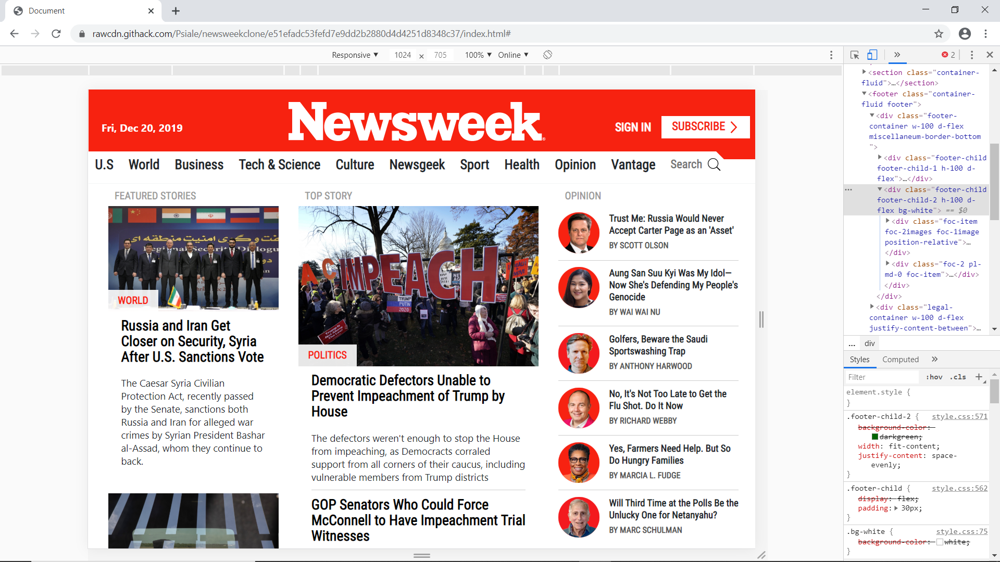
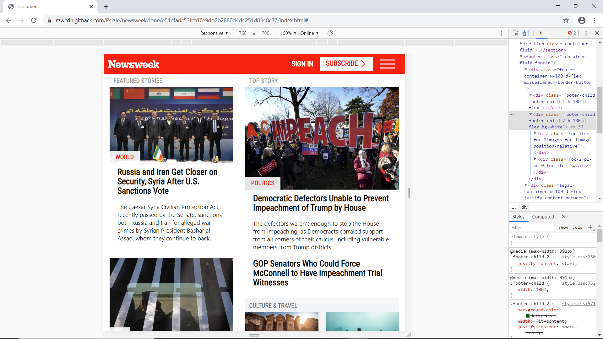
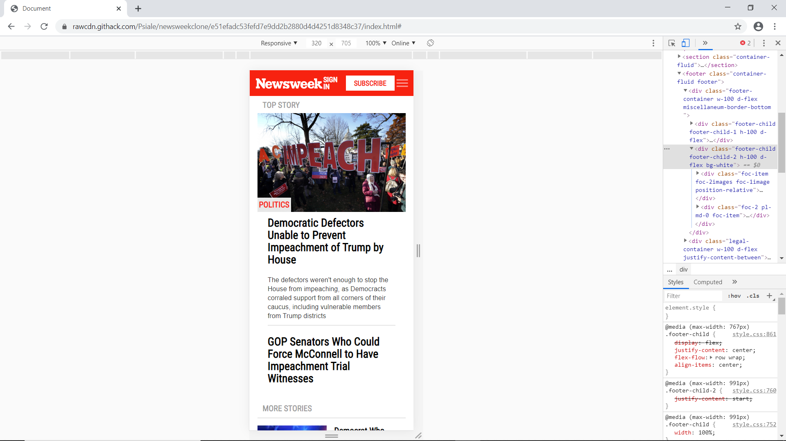

# NewsWeek Clone
### A NewsWeek clone focusing on the responsive behavior of the original website using Boostrap.

* [The purpouse of this webpage](#The-purpouse-of-this-webpage)
* [Built With](#built-with)
* [Credits](#contact)
* [Live Demo](#Live-Version)
 
# The purpouse of this webpage:
To made use of media queries and Boostrap to recreate a full responsive clone of the Newsweek website.
 

# Built With
Media queries, Boostrap and a lot of love and effort.

# Credits
### https://github.com/Psiale

# Live Version

[Live Demo](https://rawcdn.githack.com/Psiale/newsweekclone/e51efadc53fefd7e9dd2b2880d4d4251d8348c37/index.html#)
 

